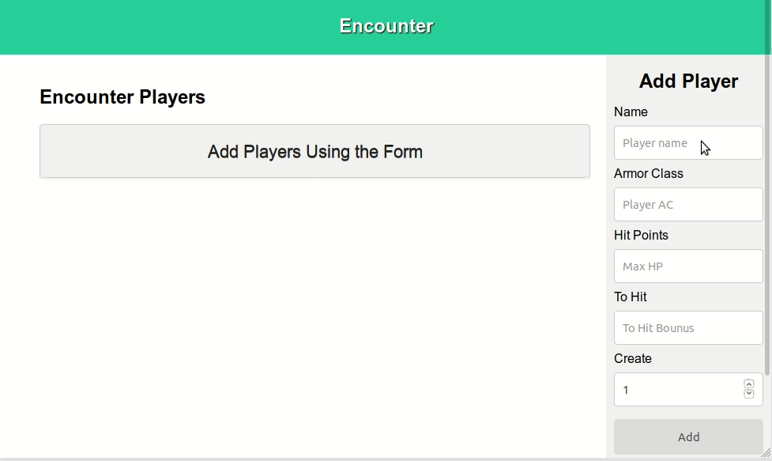

# Encounter v1
This is a basic mobile friendly tabletop game initiative tracker.

## How to use

Using the simple UI new players can be quickly added. You can also create groups of players by increasing their number in the "Create" field.

Clicking on a player turns its box green -- signaling that the player should take their turn.

Clicking on the red gavel icon turns the player box gray -- signaling that the player is down or inactive.

#### Built with HTML/CSS + JavaScript/jQuery

